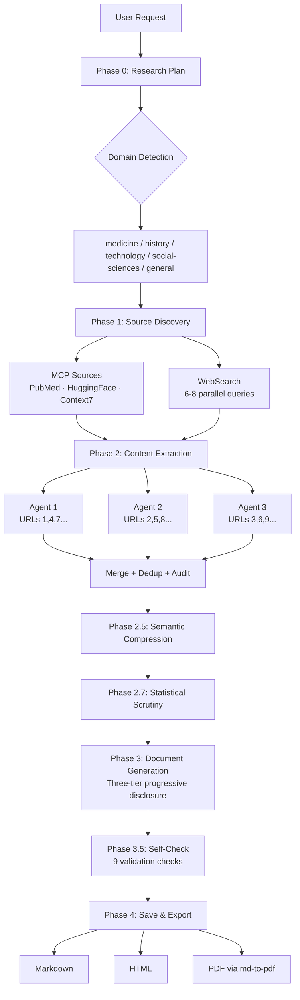

# Researcher Investigator

[](https://github.com/effecet/investigator-researcher/actions/workflows/ci.yml)
[](https://github.com/effecet/investigator-researcher/actions/workflows/gitleaks-sweep.yml)
[](#license)
[](./skill/SKILL.md)
[](https://pubmed.ncbi.nlm.nih.gov/)
[](https://huggingface.co/)
[](https://context7.com/)
[](#output-structure)
[](#how-it-works)
[](https://github.com/effecet/investigator-researcher)

A Claude Code skill that performs deep research on any topic, producing structured markdown documents with verified citations. Uses Claude's built-in WebSearch and WebFetch tools, plus MCP servers (PubMed, Hugging Face, Context7) when available — no API keys required for core research. Optional PDF export requires Node.js.

## Architecture



## Project Structure

```
investigator-researcher/
├── README.md
├── Makefile                        # install / test / lint / format targets
├── pyproject.toml                  # ruff config (lint + format)
├── requirements-dev.txt            # pyyaml + pytest
├── .github/workflows/              # CI: ruff + pytest, plus gitleaks sweep
├── skill/
│   ├── SKILL.md                    # Skill definition (v2.2 — full pipeline logic)
│   └── templates/
│       └── readme_template.md      # Output document template
├── tests/
│   └── test_skill_spec.py          # Frontmatter + regex + slugify + budgets
├── research_output/                # Generated research documents (gitignored)
│   ├── medicine/                   # Medical/health research
│   ├── history/                    # Historical research
│   ├── mythology/                  # Mythology research
│   └── .gitkeep
└── docs/
    ├── PIPELINE.md                 # Phase-by-phase maintenance map
    └── superpowers/
        └── specs/                  # Skill specification documents
```

## Installation

The skill is packaged as a Claude Code directory-format skill. Claude Code
auto-discovers skills by directory name — no separate command registration
is needed.

```bash
make install     # copies skill/ → ~/.claude/skills/researcher-investigator/
```

Or manually: `rsync -a skill/ ~/.claude/skills/researcher-investigator/`

Once installed, invoke with `/research` (aliases: `/investigate`,
`/lit-review`) or by asking Claude to research a topic in natural language.

### Optional: PDF export

```bash
npm install -g md-to-pdf
```

Required only for `export: pdf` and `export: all`. Skip if you only need
markdown or HTML output.

## Usage

### Slash command

```
/research
```

Then provide the topic when prompted. Aliases: `/investigate`, `/lit-review`.

### Natural language (auto-trigger)

Just ask Claude to research something:

> "Research the effects of microplastics on marine life"
> "Investigate recent advances in quantum computing"
> "Do a literature review on CRISPR gene editing"

### Parameters

| Parameter | Values | Default | Description |
|-----------|--------|---------|-------------|
| `topic` | any string | *required* | The research topic or question |
| `depth` | brief / standard / deep | standard | Controls source count: 3-5 / 8-12 / 15-25 |
| `citation_style` | APA / MLA / IEEE | APA | Reference formatting style |
| `verification_mode` | normal / strict | strict | strict verifies all URLs; normal samples 3-5 |
| `figure_density` | auto / high | auto | auto = figures where data warrants; high = every quantitative claim |
| `export` | md / html / pdf / both / all | md | md = markdown only; html = md + styled HTML; pdf = **PDF only** (intermediate `.md` is deleted after conversion); both = md + html; all = md + html + pdf |

## How it works

1. **Plan** — Analyzes the topic, drafts search queries, presents a research plan for approval
2. **Discover** — Runs WebSearch queries prioritizing academic, government, and institutional sources
3. **Extract** — Fetches top sources with WebFetch, extracts claims and cross-references them
4. **Verify** — Checks citation URLs and classifies them as verified / unverified / broken
5. **Compress** — Builds a semantic knowledge map: plain-language claims, numbers for figures, comparison candidates, relationship chains, and a jargon dictionary
6. **Generate** — Produces an accessible document with plain language, comparison tables, numbered figures, and key takeaways per section
7. **Save** — Writes to `./research_output/{domain}/{topic-slug}.md`. Optionally exports HTML and/or PDF

## Output structure

Each research document includes:

- **The Bottom Line** — Direct answer and "3 things to remember"
- **What You Need to Know** — Plain-language context, every term explained
- **What the Research Shows** — Thematic subsections with key takeaway boxes and numbered figures
- **The Numbers at a Glance** — Collected figures, comparison tables, and data highlights
- **Where Experts Disagree** — Conflicting evidence presented as "Side A vs. Side B"
- **What We Still Don't Know** — Research gaps stated as questions
- **How This Research Was Done** — Methodology, limitations, and a reader disclaimer
- **References** — Formatted citations with verification badges: `[verified]`, `[unverified]`, `[broken as of YYYY-MM-DD]`

## Design principles

- **No fabrication.** DOIs, author names, and URLs are never invented. Uncertain details are marked `[verification required]`.
- **Transparency.** Every document discloses how it was produced and its limitations.
- **Cross-referencing.** Single-source claims are flagged. Multi-source findings are stronger.
- **Graceful degradation.** If searches or fetches fail, the skill reports what it found rather than failing entirely.
- **Optional dependencies.** Core research uses only Claude's built-in tools. PDF export (optional) requires `md-to-pdf` installed globally (`npm install -g md-to-pdf`). Never use `npx` — it causes npm cache permission errors.
- **MCP-first.** When available, MCP servers (PubMed, Hugging Face, Context7) provide structured data directly, skipping HTML parsing. Falls back to web-only if MCP is unavailable.

## Development

Edit `skill/SKILL.md` to modify the skill behavior, then re-install:

```bash
make install      # rsync skill/ → ~/.claude/skills/researcher-investigator/
make test         # pytest spec validation (frontmatter, regex, slugify, budgets)
make lint         # ruff check
make format-check # ruff format --check (CI runs this — fix locally first)
```

CI runs on GitHub Actions (`.github/workflows/ci.yml`): `ruff format --check`,
`ruff check`, and `pytest` on every push and pull request, plus a weekly
gitleaks secret sweep (`.github/workflows/gitleaks-sweep.yml`).

The template in `skill/templates/readme_template.md` defines the base
document structure. Phase-by-phase maintenance notes live in
[`docs/PIPELINE.md`](docs/PIPELINE.md).

## License

MIT
