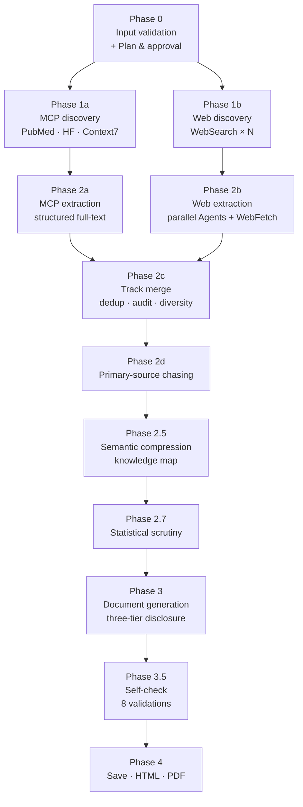

# Pipeline Overview

Companion to `skill/SKILL.md`. SKILL.md is the executable spec — long and
prescriptive. This file is the maintenance map: one-paragraph summary per
phase so you can navigate without re-reading 1,400 lines.

## Phase 0 — Validate + Plan

Topic string is unicode-normalized (NFKD), checked against the character
whitelist `[a-zA-Z0-9 ,.'()&\-?:/_]`, and bounded to 3–500 chars. Custom
profiles parsed and validated. Incremental mode scans the detected domain's
subfolder first (capped at 200 most-recent files). Plan presented to user;
no fetching until approval.

## Phase 1 — Discovery (parallel tracks)

**1a (MCP)** — domain-conditioned: PubMed for medicine, Hugging Face for
technology, Context7 conditionally when the topic names a specific library.
Each server is probed once; on failure the track is disabled for the rest
of the run and its `fallback_search` modifier is folded into 1b queries.

**1b (Web)** — WebSearch queries informed by the domain profile's
`preferred_sources` and `search_modifiers`. Query count reduced by the
number of successful 1a queries (always ≥ 1 web query for diversity).
Results ranked by authority tier and pre-filtered by predicted fetch
quality.

## Phase 2 — Extraction + Merge

**2a (MCP)** — already-structured results from 1a. PubMed full-text via
`get_full_text_article` when PMCID exists; abstract otherwise. Context7
results skip 2a (content arrives extracted at 1a).

**2b (Web)** — URLs partitioned round-robin across 2–3 Agent subagents
(same-domain URLs co-located to avoid concurrent host hits). Each agent
batches WebFetch at ≤2 parallel. Falls back to main-thread WebFetch if the
Agent tool is unavailable. Errors tracked against the web error budget
(5 cumulative = stop).

**2c (Merge)** — dedup across tracks by DOI / PMID / title-author match
(MCP wins on collision). Fetch audit log assembled per track. Source
diversity computed: if >60% concentrate in one channel, targeted queries
attempt to rebalance.

**2d (Chase)** — secondaries' cited primary sources are pursued.
PubMed MCP path: `convert_article_ids` → `find_related_articles` →
`get_article_metadata`. Web fallback path counts toward the global web
error budget; MCP chasing has its own.

## Phase 2.5 — Semantic Compression

Internal reasoning step (never rendered). Every claim is restated in plain
language, tagged with provenance chains, and assigned a confidence level
(HIGH / MEDIUM / LOW). Echo-chamber detection: N citations all tracing to
one original count as one independent source. Numbers extracted with
sample size and study design. Comparisons identified for table candidates.

## Phase 2.7 — Statistical Scrutiny

Quantitative claims annotated with evidence tier (`[meta-analysis]`,
`[RCT]`, `[cohort, n=X]`, etc.). Small samples (n<30), missing controls,
extreme effect sizes, and relative-only risk reporting are flagged for
output decoration. Conflicting numbers surfaced rather than silently
resolved.

## Phase 3 — Document Generation

Three-tier progressive disclosure: Bottom Line (30 seconds), Key Findings
Summary (3 minutes), full sections (full read). Word budgets per depth
table; each depth row sums to 100% across sections (covered by
`tests/test_skill_spec.py::TestWordBudgets`). Writing rules enforce
sentence length, jargon parentheticals, inline confidence markers, and
inline perspective framing.

## Phase 3.5 — Self-Check

Eight checks before save: citation integrity, Bottom Line alignment, Key
Findings alignment, figure/table minimums, confidence markers, redundancy
limit, Evidence Quality Appendix completeness, cross-reference integrity,
MCP citation quality (PMID/DOI presence). Failures are fixed inline; no
full regeneration.

## Phase 4 — Save and Export

Topic slugified per the algorithm tested in
`tests/test_skill_spec.py::TestSlugify`. Saved to
`./research_output/{domain}/{slug}.md` with duplicate detection. Optional
HTML export via inline-CSS template. Optional PDF export via globally
installed `md-to-pdf`. **`export: pdf` is PDF-only** — the intermediate
`.md` is deleted after successful conversion. Completion summary
includes the full audit: counts per track, diversity, funding profile,
echo flags, evidence tiers.
